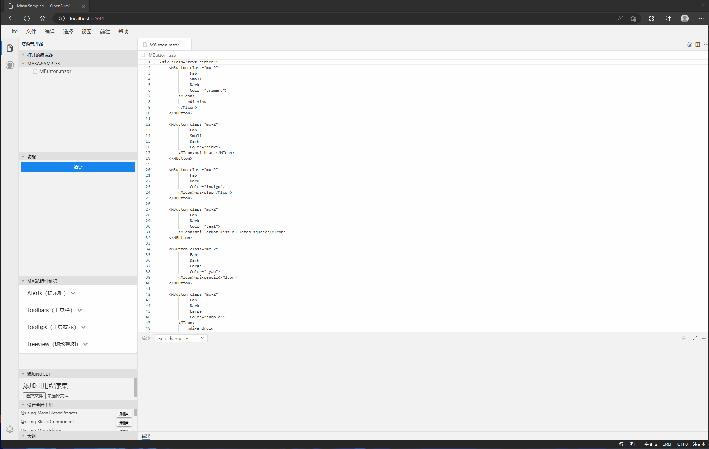

# MASA.Code

目前支持Blazor razor组件动态渲染
如果你想修改vscode的相关界面 请前往web下的项目 

## 准备前端项目环境

1. 安装依赖

```shell
yarn
```

2. 启动前端项目

```shell
yarn start
```

## 对于前端节目的修改

如果您想对于Ide的界面修改的话请参考 [OpenSumi](https://opensumi.com/zh)
当前项目的Ide完全是由 OpenSumi构建完成

## 渲染逻辑

项目动态编译是由 [MASA.Blazor.Extensions](https://github.com/BlazorComponent/MASA.Blazor.Extensions) 提供支持
动态渲染由 `DynamicComponent ` 实现 ,先由 `MASA.Blazor.Extensions` 将 `Code` 部分编译成程序集 在程序集中获取到对应的 `Type` 将 `Type` 传入`DynamicComponent` 实现动态渲染
动态编译注意事项请留意 [MASA.Blazor.Extensions](https://github.com/BlazorComponent/MASA.Blazor.Extensions)

## 使用MASA.Code的功能

// 添加引用
```csharp
builder.Services.AddMasaCodeShared();
```

// 将ServiceProvider传递进去
```csharp
app.Services.UseServiceProvider();
```

## 开发文档

由于web-ide和WebAssembly俩个项目是隔离开的需要nginx代理将俩个服务集成一个端口使用

1. 打开`nginx/conf.d`配置文件 修改配置文件中的IP地址为本机的局域网地址（应为docker未使用本机host所以需要使用局域网IP）

2. 进入`web`初始化项目

   初始化npm

   ```shell
   npm i
   ```

   启动项目

   ```shell
   npm run start
   ```

 3. 进入 `src`打开`Blazor.Code.sln`解决方案

    启动`Blazor.Code.WebAssembly`项目

    
然后就可以开始开发`Web-IDE`了，

## 项目部署

 当前将项目开发完成以后进行部署
 1. 进入`web`项目
 2. 执行`build`指令将前端界面`build`
 	```shell
 	npm run build
 	```
 	构建成功以后将`dist`文件夹下面的文件`copy`到你要发布的项目类型中
 	
 	`WebAssembly`项目将`dist`复制到`wwwroot`文件夹下面并且发布项目即可
 	
 	`Maui`项目将`dist`复制到`wwwroot`文件夹下面并且发布项目即可
 	
 	··`WinForm`项目将`dist`复制到`wwwroot`文件夹下面并且发布项目即可
 
 然后就可以愉快的使用项目了
 

## 效果预览：




## 演示地址

[进入](http://masa.tokengo.top:81/)
